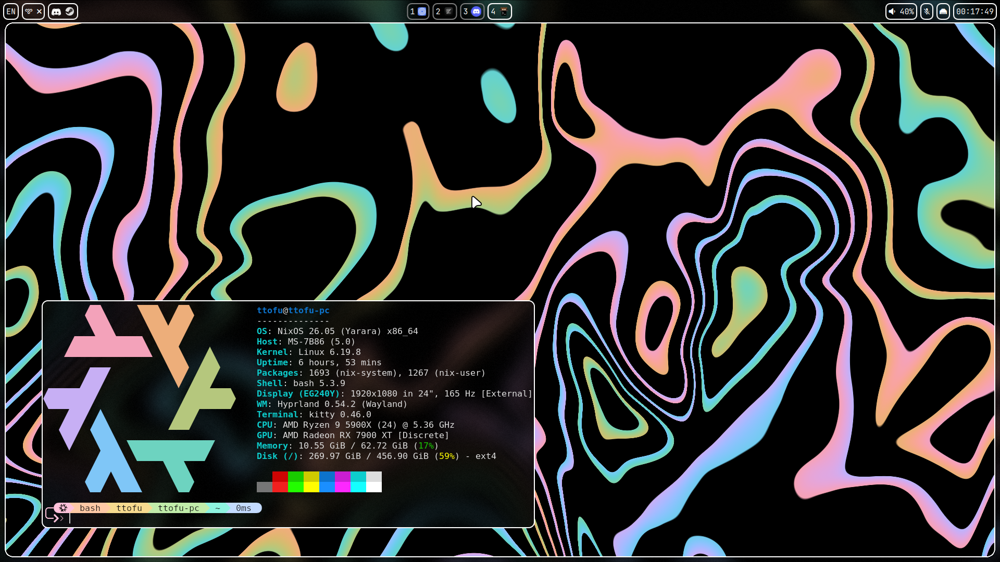

# ttofu's NixOS config



## Installation

1. Install NixOS and add these lines to your `/etc/nixos/configuration.nix`

```nix
...
networking.hostName = "<your hostname>";
environment.systemPackages = with pkgs; [
  ...
  git
  ...
];
nix.settings.experimental-features = ["nix-command" "flakes"];
nixpkgs.config.allowUnfree = true;
programs.nh.enable = true;
...
```

2. Rebuild the system:

```sh
$ sudo nixos-rebuild switch
```

3. Clone this repository and enter it:

```sh
$ git clone https://github.com/tt0fu/nixos-config
$ cd nixos-config
```

4. Add your `hardware-configuration.nix` as a module in `./modules/systems/<your hostname>.nix`. Don't forget to wrap it:

```nix
# modules/systems/<your hostname>.nix
{
  os = <the contents of the original hardware-configuration.nix>
}
```

So it will look something like this:

```nix
# modules/systems/<your hostname>.nix
{
  os =
    {
      pkgs,
      config,
      lib,
      modulesPath,
      ...
    }:

    {
      imports = [
        (modulesPath + "/installer/scan/not-detected.nix")
      ];
      ...
    };
}
```

5. Go to `settings.nix`. Add your hostname to the `systems` attrset, copying the configuration from other systems. Change the settings to your liking, they should be self-explanatory. Make sure to add `systems.<your hostname>` to the module list.

6. Build the system and reboot:

```sh
$ ./build.sh boot && reboot
```

After rebooting, you should now see the config successfully applied to your install.

## Module structure

Each module has the following structure:

```nix
{
  os = <nixos configuration expression>
  home = <home-manager configuration expression>
  deps = modules: with modules; [
    <list of modules this module depends on>
  ];
  <any additional attributes that can be referenced with "allModules", "usedModules" or "self" special arguments>
}
```

A hypothetical example:

```nix
# modules/progs/example/foo.nix
{
  os =
  { ... }:
  {
    services.foo.enable = true; # enables the foo service via a nixos option
  };

  home =
  { self, ... }:
  {
    home.packages = [
      self.foo-status-package # installs the "foo-status" package defined below through home-manager
      # can also be referenced as allModules.progs.example.foo.foo-status-package
    ];
  };

  foo-status-package = pkgs.writeShellScriptBin "foo-status"  # defines a derivation for a custom shell script
  ''
    watch fooctl --status
  '';

  deps = modules: with modules; [
    progs.example.bar # sets modules/progs/example/bar.nix as a dependency, which will enable the bar module if the foo module is enabled
  ];
}
```

The structure of the `deps` attribute is the same as the module list in `settings.nix`. Adding a module with dependencies will add all of it's dependencies.

## Usage

- To rebuild, run `build.sh` with the command of nh os and any additional arguments. For example: `build.sh boot --install-bootloader` or `build.sh repl`, etc. The default command is `switch`.
- To update and rebuild, run `update.sh` with the command of nh os and any additional arguments. The default command is `boot`.
- To clean unused files, delete previous generations and optimize the nix store, run `clean.sh`.
