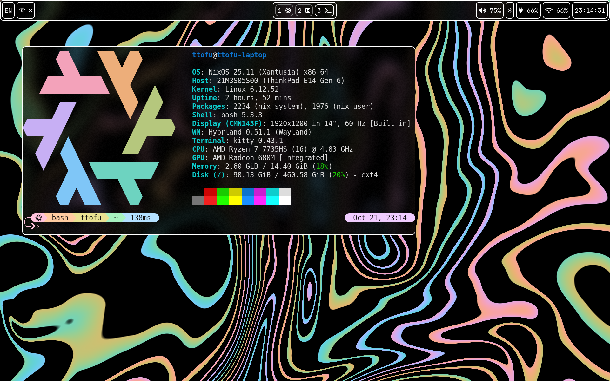

# ttofu's NixOS config



## Installation

1. Install NixOS and add these lines to your `/etc/nixos/configuration.nix`

```
...
networking.hostName = "<your hostname>";
environment.systemPackages = with pkgs; [
  ...
  git
  ...
];
nix.settings.experimental-features = ["nix-command" "flakes"];
nixpkgs.config.allowUnfree = true;
...
```

2. Rebuild the system:

```
$ sudo nixos-rebuild switch
```

3. Clone this repository and enter it:

```
$ git clone https://github.com/tt0fu/nixos-config
$ cd nixos-config
```

4. Add your `hardware-configuration.nix` as a module in `./modules/systems/<your hostname>.nix`. Don't forget to wrap it:

```
# modules/systems/<your hostname>.nix
{
  os = <the contents of the original hardware-configuration.nix>
}
```

So it will look something like this:

```
# modules/systems/<your hostname>.nix
{
  os =
    {
      pkgs,
      config,
      lib,
      modulesPath,
      ...
    }:

    {
      imports = [
        (modulesPath + "/installer/scan/not-detected.nix")
      ];
      ...
    };
}
```

5. Go to `settings.nix`. Add your hostname to the `systems` attrset, copying the configuration from other systems. Change the settings to your liking, they should be self-explanatory. Make sure to add `systems.<your hostname>` to the module list.

6. Build the system and reboot:

```
$ build.sh boot && reboot
```

After rebooting, you should now see the config successfully applied to your install.

## Module structure

Each module has the following structure:

```
{
  os = <nixos configuration expression>
  home = <home-manager configuration expression>
  deps = modules: with modules; [
    <list of modules this module depends on>
  ];
}
```

The structure of the `deps` attribute is the same as the module list in `settings.nix`. Adding a module with dependencies will add all of it's dependencies.

## Usage

- To rebuild, run `build.sh` with the command of nixos-rebuild. For example: `build.sh boot` or `build.sh repl`, etc. The default argument is `switch`.
- To update and rebuild, run `update.sh` with the command of nixos-rebuild. The default argument is `boot`.
- To clean unused files, delete previous generations and optimize the nix store, run `clean.sh`.
